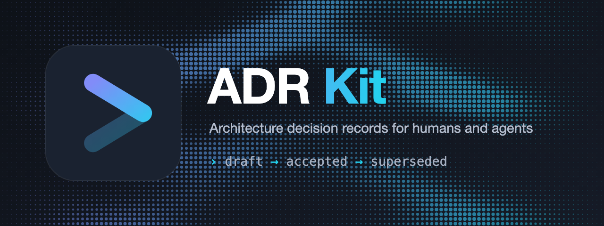

<div align="right">
  <a title="English" href="https://github.com/luochang212/adr-kit/blob/main/README.md"></a>
  <a title="简体中文" href="https://github.com/luochang212/adr-kit/blob/main/README.zh.md"></a>
</div>

# ADR Kit

<p>
  <a href="https://www.npmjs.com/package/adr-kit"></a>
  <a href="https://www.npmjs.com/package/adr-kit"></a>
  <a href="https://github.com/luochang212/adr-kit/blob/main/LICENSE"></a>
  <a href="https://zread.ai/luochang212/adr-kit"></a>
  <a href="https://github.com/luochang212/adr-kit/actions/workflows/ci.yml"></a>
</p>

<p>
  
</p>

ADR Kit 把架构决策变成纯 Markdown 文件，并带有机检的生命周期。决策是持久记录
（**accepted / superseded**）；提案是临时草稿，要么变成决策、要么消失。它借鉴了
[OpenSpec](https://github.com/Fission-AI/OpenSpec) 的 spec-driven 思路，以及
agent 原生代码库的决策记录纪律：每条记录都必须说明它解决什么问题、选择了什么、
放弃了什么。

- 灵活而不僵化
- 纯 Markdown
- 一个决策一个文件
- 同时服务人类和 agent

## 快速开始

需要 Node.js 20.19 或更高版本。

```bash
npm install -g adr-kit
cd your-project
adrkit init
adrkit decide "使用 SQLite 存储会话"
```

`adrkit init` 会创建 `adr/` 目录：

```text
adr/
├── config.yaml      # 项目上下文与分状态规则
├── README.md        # 仓库约定
├── .gitignore       # 让 adr/.drafts/ 不进 git
└── decisions/       # 决策，按 N 编号，不可变历史
```

提案是 `adr/.drafts/` 里的临时草稿：`adrkit propose` 创建一条，
`adrkit accept` 把它提升为编号决策，`adrkit reject` 直接丢弃、不留下任何记录。
拒绝记录在决策的 `Alternatives considered` 里，从不是独立记录。

填写决策内容后：

```bash
adrkit validate
adrkit list
```

## 告诉你的 Agent

把下面这行贴给任意 AI 编码 Agent，它就会自动把关键决策记录成 ADR：

```text
在本仓库用 github.com/luochang212/adr-kit 自动记录关键架构决策
```

## 命令

```text
adrkit init [path] [--tools <list>]    初始化 ADR Kit 仓库
adrkit decide <title>                  直接记录已做的决策（默认路径）
adrkit propose <title>                 创建临时提案草稿
adrkit accept <name>                   把草稿提升为决策（分配 N 编号）
adrkit reject <name> [--reason <text>] 丢弃草稿（不留记录）
adrkit supersede <name> --by <name>    标记已接受决策被新决策取代
adrkit list [--json]                   列出决策与待决草稿
adrkit show <name>                     查看决策或草稿
adrkit status [--json]                 查看生命周期计数与校验状态
adrkit instructions [--json]           查看下一步；标注待决草稿已就绪或需修改
adrkit validate [name] [--all] [--json] 校验单条记录或整个仓库
adrkit update [--tools <list>]         重写 AI 工具集成文件
adrkit config [--json]                 查看当前配置
adrkit graph [--mermaid|--dot|--json] [--formal-only]
                                       输出决策关系图
adrkit completion <bash|zsh|fish>      打印 shell 补全脚本
adrkit version                         查看版本
```

> [!IMPORTANT]
> 集成默认写入开放的 [`.agents/`](https://agents.md/) 标准——一套技能和斜杠
> 命令，所有主流 Agent 通用。Claude Code 是唯一的例外：它不仅[关闭了
> AGENTS.md 支持请求](https://github.com/anthropics/claude-code/issues/6235)，
> 还让 [Shopify CEO 公开放话要因此禁用它](https://thenewstack.io/shopify-claude-code-agentsmd/)。
> 如果你的团队用 Claude Code，加 `--tools claude` 会同时安装 `.claude/`
> 副本——这个例外我们一直背到 Anthropic 采纳标准为止。

`<name>` 支持按标题、文件名或决策编号（`1`）查找。

## 文档

| 文档 | 内容 |
| --- | --- |
| [CLI 参考](https://github.com/luochang212/adr-kit/blob/main/docs/zh/cli.md) | 命令参考：参数与 `--json` 输出 |
| [记录格式](https://github.com/luochang212/adr-kit/blob/main/docs/zh/record-format.md) | ADR 文件格式与校验规则 |
| [工作流](https://github.com/luochang212/adr-kit/blob/main/docs/zh/workflow.md) | 从提案到决策的生命周期 |
| [Agent 技能](https://github.com/luochang212/adr-kit/blob/main/skills/README.md) | 驱动 `adrkit` CLI 的 agent 技能 |

## 记录格式

每条记录都是 YAML front matter 加 Markdown 正文：

```markdown
---
status: accepted
date: 2026-08-19
commit: abc1234
---

# ADR: 1 使用 SQLite 存储会话

## Problem
...
```

`date` 字段记录当前状态达成的日期；CLI 在每次生命周期迁移时自动盖章，
同时盖上该决策对应的 git `commit`。决策是不可变历史；当前事实以代码为准，
不在记录里。

- **决策**（`adr/decisions/N-slug.md`）是 `accepted` 或 `superseded`，
  需要 `Problem`、`Decision`、`Alternatives considered`、`Consequences`；
  `validate` 会拒绝提案时代的标题出现在已接受决策中。
- **草稿**（`adr/.drafts/YYYY-MM-DD-slug.md`）是 `status: proposed` 的临时
  提案，需要 `Problem`、`Proposal`、`Alternatives considered`、
  `Acceptance criteria`、`Risks`，`validate` 不检查它们——`adrkit accept`
  在提升前才校验草稿。
- **被否决**的想法不是独立记录：决策的 `Alternatives considered` 记录了
  考虑过什么、为什么落选。
- **Superseded** 决策保留在 `adr/decisions/` 作为历史，front matter 指向
  取代它的决策：`status: superseded` 加 `superseded-by: N`。
  `adrkit supersede <旧> --by <新>` 完成改写；
  `validate` 校验 `N` 存在且自身未被取代。

`adrkit accept` 会自动完成生命周期迁移所要求的改写：`## Proposal` 改为
`## Decision`，`Acceptance criteria` 与 `Risks` 合并进 `## Consequences`。

## 工具兼容性

ADR Kit 只拥有一个目录——`adr/`——并且只读取和校验自己的文件，因此可以
与任何不占用该布局的工具共处于一个仓库。它的 agent skills 按工具命名空间
隔离（`adrkit-*`），`adrkit update` 只重写自己的集成文件。

| 工具 | 角色 | 与 ADR Kit 的关系 |
|---|---|---|
| [OpenSpec](https://github.com/Fission-AI/OpenSpec) | 前瞻：规定要构建什么 | 互补——规格与记录各司其职 |
| [Changesets](https://changesets.dev) | 发布：版本号与 changelog | 正交——changeset 正文引用 ADR 编号 |

当某个变更做出了应比变更本身更长命的架构决策时，把它记成一条 ADR。

## 灵感来源

ADR Kit 站在两个项目之上，两者角色不同：

- **[OpenSpec](https://github.com/Fission-AI/OpenSpec)** 决定了这个工具*怎么建*：
  agent 优先的 CLI、指令以 agent skills 安装、确定性的 `validate`、
  机器可读的 `--json` 输出，以及"灵活而不僵化"的工作流。和 OpenSpec 一样，
  ADR Kit 靠*引导* agent（会话开始可见的 skills），而不是硬性阶段门禁，
  也不强制每次变更都记录。
- **[deepseek-harness](https://github.com/deepseek-ai/deepseek-harness)**
  决定了 ADR Kit 里*记录是什么*。它的 **Agent Notes**：带 `Status:` 行的
  纯 Markdown、生命周期文件夹（`proposed` → `implemented` → `rejected`，
  外加冻结归档）、以及 `Problem` / `Proposal`·`Decision` /
  `Alternatives considered` / `Consequences` 骨架，是 ADR Kit 记录格式的
  直接祖先。

是改编，不是照抄。已接受记录带 `N` 编号，`supersede` 原地退役一条决策，
`accept` 机械地把提案改写成决策。记录一旦接受就不可变：决策记录是历史，
当前事实以代码为准，不在记录里。

## 理念

- **记录是事实来源。** 代码注释会腐化，文档会漂移；一条写明了决定与代价的
  ADR 会持续有用。
- **备选方案是强制项。** 没有记录被否决方案的决策，是在邀请未来的重复争论。
- **生命周期是机械操作，不是编辑操作。** 提升草稿、退役已接受决策都是命令
  （`accept`、`supersede`），`validate` 强制检查结果形态。
- **Agent 是一等用户。** 纯 Markdown、可预测的路径、需要时可输出 JSON。

## 开发

```bash
npm install
npm run typecheck
npm test
npm run build
```

## 许可证

[MIT](https://github.com/luochang212/adr-kit/blob/main/LICENSE)
