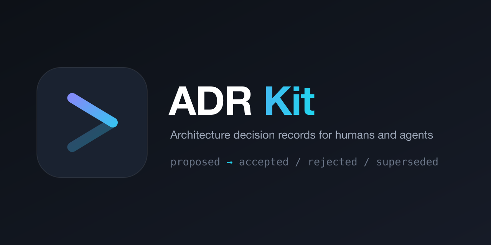

<p align="center">
  
</p>

<p align="center">
  <a href="https://www.npmjs.com/package/adr-kit"></a>
  <a href="https://github.com/luochang212/adr-kit/actions/workflows/ci.yml"></a>
  <a href="https://www.npmjs.com/package/adr-kit"></a>
  <a href="https://nodejs.org/"></a>
  <a href="LICENSE"></a>
</p>

<p align="center">
  <a href="README.md">English</a> | <a href="README.zh.md">中文</a>
</p>

ADR Kit 把架构决策变成纯 Markdown 文件，并带有机检的生命周期：
**proposed → accepted / rejected / superseded**。它借鉴了
[OpenSpec](https://github.com/Fission-AI/OpenSpec) 的 spec-driven 思路，以及
agent 原生代码库的决策记录纪律：每条记录都必须说明它解决什么问题、选择了什么、
放弃了什么。

```text
→ 灵活而不僵化
→ 纯 Markdown，无 front matter
→ 一个决策一个文件
→ 同时服务人类和 agent
```

## 快速开始

需要 Node.js 20.19 或更高版本。

```bash
npm install -g adr-kit
cd your-project
adrkit init
adrkit propose "使用 SQLite 存储会话"
```

`adrkit init` 会创建 `adr/` 目录：

```text
adr/
├── config.yaml      # 项目上下文与分状态规则
├── README.md        # 仓库约定
├── decisions/       # 已接受决策，按 NNNN 编号
├── proposed/        # 待决策提案
└── rejected/        # 已拒绝提案，冻结保存
```

填写提案内容后：

```bash
adrkit validate
adrkit accept "使用 SQLite 存储会话"
adrkit list
```

## 命令

```text
adrkit init [path]                   初始化 ADR Kit 仓库
adrkit propose <title>                创建提案
adrkit decide <title>                 直接记录已接受的决策
adrkit accept <name>                  接受提案（分配 NNNN 编号）
adrkit reject <name> --reason <text>  拒绝提案
adrkit supersede <name> --by <name>   标记已接受决策被新决策取代
adrkit list [--json]                  列出所有记录
adrkit show <name>                    查看记录
adrkit status [--json]                查看生命周期计数与校验状态
adrkit instructions [--json]          查看下一步该做什么
adrkit validate [name] [--all] [--json] 校验单条记录或整个仓库
adrkit update [--tools <list>]         重写 AI 工具集成文件
adrkit config [--json]                查看当前配置
adrkit completion <bash|zsh|fish>     打印 shell 补全脚本
adrkit version                        查看版本
```

`<name>` 支持按标题、文件名或决策编号（`0001`）查找。

## 记录格式

每条记录都是纯 Markdown，头部固定三行：

```markdown
# ADR: 使用 SQLite 存储会话

Status: proposed

## Problem
...
```

- **Proposed** 需要 `Problem`、`Proposal`、`Alternatives considered`、
  `Acceptance criteria`、`Risks`。
- **Accepted** 需要 `Problem`、`Decision`、`Alternatives considered`、
  `Consequences`；`validate` 会拒绝提案时代的标题出现在已接受决策中。
- **Rejected** 冻结提案，拒绝原因写在状态行：`Status: rejected — <reason>`。
- **Superseded** 决策保留在 `adr/decisions/` 作为历史，状态行指向取代它的决策：
  `Status: superseded by NNNN`。`adrkit supersede <旧> --by <新>` 完成改写；
  `validate` 校验 `NNNN` 存在且自身未被取代。

`adrkit accept` 会自动完成生命周期迁移所要求的改写：`## Proposal` 改为
`## Decision`，`Acceptance criteria` 与 `Risks` 合并进 `## Consequences`。

## 理念

- **记录是事实来源。** 代码注释会腐化，文档会漂移；一条写明了决定与代价的
  ADR 会持续有用。
- **备选方案是强制项。** 没有记录被否决方案的决策，是在邀请未来的重复争论。
- **生命周期是机械操作，不是编辑操作。** 提案转接受或拒绝、已接受决策被取代，
  都是一条命令，`validate` 强制检查结果形态。
- **Agent 是一等用户。** 纯 Markdown、可预测的路径、需要时可输出 JSON。

## 开发

```bash
npm install
npm run typecheck
npm test
npm run build
```

## 许可证

[MIT](LICENSE)
