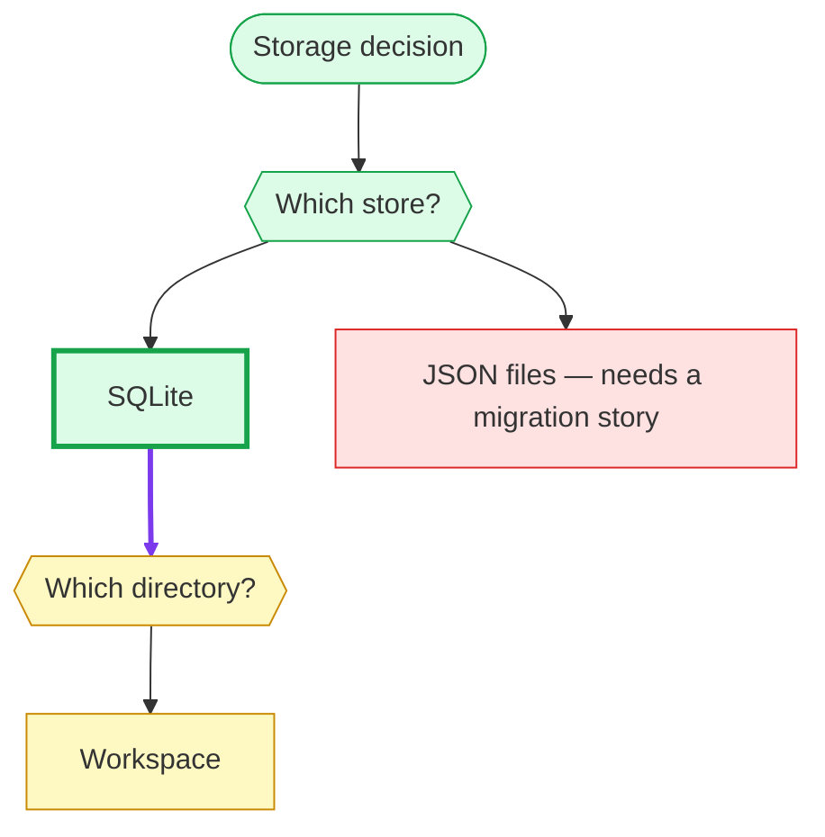

# CLI Reference

Run from anywhere inside a project; commands discover the nearest `adr/`
directory by walking upward.

## Global options

| Option | Description |
| --- | --- |
| `-h, --help` | Print help (`adrkit help` does the same) |
| `-V, --version` | Print the version |

## Commands

### `adrkit init [path] [--tools <list>] [--workflows <list>]`

Create an `adr/` repository in `path` (default: current directory) and
install the agent integration into `.agents/` (`commands/` + `skills/`) -
the vendor-neutral convention every mainstream agent reads. `--tools claude`
additionally installs `.claude/` copies for Claude Code (the one agent that
does not read `.agents/`); `--tools none` installs nothing.

`--workflows <list>` installs a subset of the eight workflow skills
(`init, grill, propose, decide, validate, accept, reject, supersede`) instead
of all of them, useful for small repositories that only exercise the
decide/validate path. Entries may carry the `adrkit-` prefix;
`--workflows all` is the explicit full set (also the default). The subset
is recorded in `adr/config.yaml` so a bare `adrkit update` keeps it.

```text
adr/
├── config.yaml
├── README.md
├── .gitignore     # keeps adr/.drafts/ out of git
└── decisions/
```

Proposals are ephemeral drafts in `adr/.drafts/`; the directory is created
on the first `adrkit propose`.

### `adrkit decide <title> --raised-by <human|agent> --decided-by <human|agent>`

Record an already-made decision in `adr/decisions/N-slug.md` with the
next available number. This is the default path. Titles must not start with
a number.

Both declarations are required. `--raised-by` records who put the decision on
the table. `--decided-by` records whose judgment settled it: `human` when a
person determined the direction (they stated it, changed a proposal into what
shipped, or you are recording one they made earlier), `agent` when it came from
the agent's own judgment, including when a person only let it through. Either
axis may be `human` or `agent`. The CLI records the declarations without
inferring or checking them. When the writer cannot tell which value applies, ask
before recording; the body is where nuance about who proposed and who approved
belongs.

### `adrkit propose <title>`

Create an ephemeral proposal draft in `adr/.drafts/YYYY-MM-DD-slug.md`. A
draft is temporary: `accept` promotes it to a numbered decision, `reject`
discards it without leaving a record. Titles must not start with a number.
Drafts carry neither `raised-by` nor `decided-by`; writing either into a
draft is an error.

### `adrkit accept <name> --raised-by <human|agent> --decided-by <human|agent>`

Validate a draft, assign the next `N` number, rewrite the lifecycle
sections, write `adr/decisions/N-slug.md`, and discard the draft.
The draft's title must not start with a number. Both declarations are required
here too, with the same meaning as for `decide`: promotion is where the values
enter the durable record.

### `adrkit reject <name> [--reason <text>]`

Discard a proposal draft from `adr/.drafts/`. No record is created -
rejection lives in the winning decision's `Alternatives considered`. The
`--reason` is optional and only echoed.

### `adrkit supersede <name> --by <name>`

Mark an accepted decision as superseded by a newer accepted decision. The
old record's front matter becomes `status: superseded` with
`superseded-by: N` and its `date` field is stamped with the supersede
date; its `raised-by` and `decided-by` values are preserved rather than
replaced: they record who raised the original decision and whose judgment
settled it, not who retired it; the file stays in `adr/decisions/` as history.
`--by` must resolve to an existing accepted decision that is not itself
superseded.

### `adrkit list`

List decisions (accepted and superseded) and any pending drafts.

### `adrkit show <name>`

Print a decision or draft. `name` resolves by title, file name, or decision
number. A record that fails to parse elsewhere in the repository does not
block `show`; `adrkit validate` still reports it.

### `adrkit status`

Print lifecycle counts (accepted, superseded, pending drafts) and
repository validity.

### `adrkit instructions`

Print the next workflow step (init, fix validation, decide, or propose). When
drafts are pending, each one is flagged as validated (ready to accept) or
needs work, so the next action is executable rather than a direction.

### `adrkit validate [name] [--all]`

Validate one record, or the whole repository when `name` is omitted or
`--all` is given. Single-record validation also checks that a
`superseded-by: N` reference points at an existing decision that is not
itself superseded.

### `adrkit update [--tools <list>] [--workflows <list>]`

Rewrite the agent integrations: the standard `.agents/` target plus, with
`--tools claude`, the `.claude/` exception. Targets that are no longer
selected are removed, and so are workflow skills outside the selection
(`--workflows all` restores every skill). Without `--tools`/`--workflows`,
the values recorded in `adr/config.yaml` are used.

### `adrkit config`

Print the current `adr/config.yaml` configuration: `context`, `tools`, the
effective `workflows` selection (the recorded subset, or the full default set
when the key is absent), and `rules`.

### `adrkit graph [--mermaid|--dot|--text|--html] [--formal-only] [--tag <tag>]`

Emit a relationship graph of the decisions: solid edges for formal
`superseded-by` references, dashed edges for `ADR-N` mentions mined from
record bodies, grouped by the `created` date so decision bursts are visible
without implying a continuous timeline. `--mermaid` (the default) renders
natively on GitHub and tints active nodes by their first `tag`; `--dot`
emits Graphviz; `--text` prints a terminal-friendly tree; `--html` emits one
offline self-contained decision map on a shared interactive canvas (drag or
scroll to pan, zoom, fit-to-view, 1:1, keyboard, and a pointer-anchored
trackpad pinch) with no CDN or renderer bundle, that links each node to its
record and marks the decisions carrying a `## Deliberation` tree. `--tag <tag>` filters to decisions
carrying that theme; `--formal-only` drops the mined edges. Note that `date` records the current status date, while `created` is
the birth date.

### `adrkit tree <name> [--mermaid|--text|--html]`

Render a record's optional `## Deliberation` appendix: the design tree behind
the decision, stored in the record as a nested Markdown list whose nodes may be
tagged `[settled]`, `[rejected]`, or `[open]`. A follow-up question is nested
under the node that raised it, so depth is the dependency. `name` resolves by
title, file name, or decision number, like the other commands. The default
`--text` output reproduces the nested outline:

```text
- Storage decision [settled]
  - Q: Which store? [settled]
    - A: SQLite [settled] (recommended)
      - Q: Which directory? [open]
        - A: Workspace [open]
    - A: JSON files [rejected] — needs a migration story
```

`--mermaid` emits a Mermaid graph: a `graph TD` header, one node per entry with
a distinct shape for the root, questions, and options, parent-to-child edges, a
`classDef` for every state plus the recommended and override styles, and a
`class` line for each state, recommendation, or override the tree actually uses.
An edge from a settled node to a follow-up question it raised is drawn thicker
and purple (a `linkStyle` line), so the tree's depth reads as the frontier
moving outward.

`--html` emits an offline, left-to-right card tree with inline CSS and JavaScript.
Questions contain their chosen answers; other options and reasons expand in
place. Follow-ups connect to the answer or question that raised them. The view
supports folding branches, dragging or scrolling to pan, zoom buttons, 1:1 and
fit-to-view, and keyboard navigation (focus the canvas, use arrows, +/−, or 0);
a trackpad pinch (Ctrl/⌘ + scroll) zooms at the pointer. State, recommendation,
and override labels remain visible. No CDN is needed.

```sh
adrkit tree 7 --html > "adr-7.html"
```

The command prints HTML to stdout and never opens a browser. The agent workflow
exports only when visualization is requested and returns a file link by default.



A record without a `## Deliberation` bullet list fails with a message naming
the record. The appendix is reference material for that decision, not part of
every task's reading.

### `adrkit completion <bash|zsh|fish>`

Print a shell completion script for the given shell.

### `adrkit version`

Print the version.
