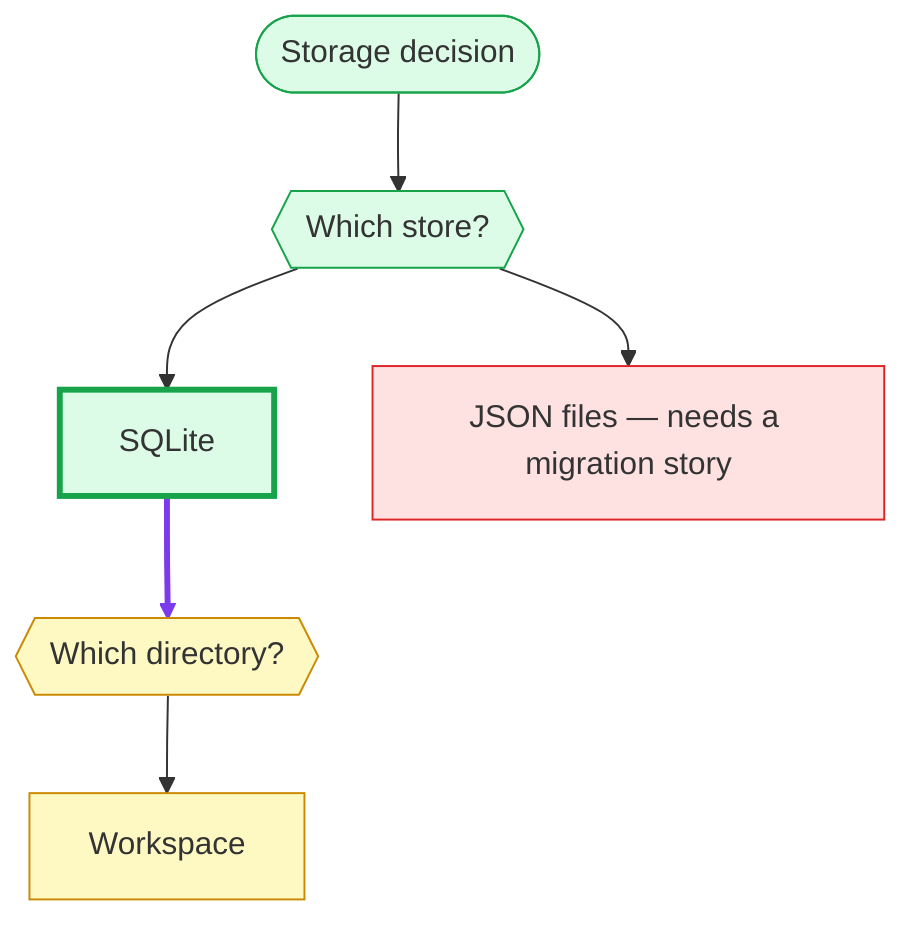

# CLI 参考

在项目任意子目录运行；命令会向上查找最近的 `adr/` 目录。

## 全局选项

| 选项 | 说明 |
| --- | --- |
| `-h, --help` | 打印帮助（`adrkit help` 等效） |
| `-V, --version` | 打印版本 |

## 命令

### `adrkit init [path] [--tools <list>] [--workflows <list>]`

在 `path`（默认当前目录）创建 `adr/` 仓库，并把 agent 集成写入 `.agents/`
（`commands/` + `skills/`），即所有主流 Agent 都识别的供应商中立约定。
`--tools claude` 额外安装 `.claude/` 副本给 Claude Code（唯一不读
`.agents/` 的 Agent）；`--tools none` 不安装任何集成。

```text
adr/
├── config.yaml
├── README.md
├── .gitignore     # 让 adr/.drafts/ 不进 git
└── decisions/
```

`--workflows visualize` 可单独安装可视化技能；默认安装全部九个工作流技能。
已选子集会在更新时保留，用 `--workflows all` 恢复全套。

提案是 `adr/.drafts/` 里的临时草稿；目录在第一次 `adrkit propose` 时创建。

### `adrkit decide <title> --raised-by <human|agent> --decided-by <human|agent>`

直接记录一条已做的决策到 `adr/decisions/N-slug.md`（默认路径）。标题不得
以数字开头。

两个声明都必填。`--raised-by` 记录谁把这条决策提上台面；`--decided-by`
记录谁的判断定下了它：方向由人决定时写 `human`（人说出的、人把 agent 的提案
改成最终落地方案的、或人此前定过而现在只是补记的），由 AI 自主判断得出时写
`agent`，包括人只是放行的情况。两个轴都可以是 `human` 或 `agent`。CLI 既不
推断也不校验，只记录声明。分不清时先问再记；谁提出、谁批准的细节写进正文。

### `adrkit propose <title>`

在 `adr/.drafts/YYYY-MM-DD-slug.md` 创建临时提案草稿。草稿是临时的：
`accept` 把它提升为编号决策，`reject` 直接丢弃、不留记录。标题不得以数字
开头。草稿既不带 `raised-by` 也不带 `decided-by`；写进去会被判为错误。

### `adrkit accept <name> --raised-by <human|agent> --decided-by <human|agent>`

校验草稿，分配下一个 `N` 编号，改写生命周期 section，写入
`adr/decisions/N-slug.md` 并删除草稿。草稿标题不得以数字开头。这里同样必须
提供 `--raised-by` 与 `--decided-by`，含义与 `decide` 一致：提升是声明进入
持久记录的时刻。

### `adrkit reject <name> [--reason <text>]`

从 `adr/.drafts/` 丢弃提案草稿。不产生任何记录：拒绝记录在胜出决策的
`Alternatives considered` 里。`--reason` 可选，仅回显。

### `adrkit list`

列出决策（accepted/superseded）与待决草稿。

### `adrkit show <name>`

打印记录。`name` 支持标题、文件名、决策编号或 slug。仓库中其他无法
解析的记录不会阻塞 `show`；`adrkit validate` 仍会报告它们。

### `adrkit status`

打印生命周期计数（accepted、superseded、待决草稿）与仓库校验状态。

### `adrkit instructions`

打印下一步工作流步骤（init、fix validation、decide 或 propose）。有待决
草稿时，每条草稿会标注为已验证（可直接接受）或需要修改，因此下一步是
可执行动作而非方向。

### `adrkit validate [name] [--all]`

校验单条记录；省略 `name` 或使用 `--all` 时校验整个仓库。单条记录校验
同样会沿 `superseded-by: N` 替代链检查引用均存在、没有循环，且最终到达
accepted 决策；中间记录可以是 superseded。

### `adrkit update [--tools <list>] [--workflows <list>]`

重写 agent 集成：标准 `.agents/` 目标，加上 `--tools claude` 时的
`.claude/` 例外；不再选中的目标会被移除。未指定 `--tools` 时使用
`adr/config.yaml` 里记录的目标。

### `adrkit config`

打印当前配置：`context`、`tools`、生效的 `workflows` 选择（记录的子集，缺省
即为全集）与 `rules`。`init` 和 `update` 还会盖 `installed-with` 章，记录最后
写入集成文件的 adr-kit 版本；`list` 和 `instructions` 拿它与当前 CLI 比较，
不一致时附一行提示——CLI 更新时建议 `adrkit update` 刷新已装技能，CLI 更旧
则提示升级。早于该章存在的仓库保持沉默。

### `adrkit graph [--mermaid|--dot|--text|--html] [--formal-only] [--tag <tag>] [--out <path>]`

输出决策关系图：实线边为 `superseded-by` 正式取代关系，虚线边为从正文
挖掘的 `ADR-N` 引用，按 `created` 创建日期分组，让决策脉冲可见而不伪造
连续时间线。`--mermaid`（默认）在 GitHub 上原生渲染，并按决策的第一个
`tag` 给活跃节点描边着色；`--dot` 输出 Graphviz；`--text` 输出终端友好的
树形视图；`--html` 输出单文件离线决策地图，运行在共享交互画布上（拖动或滚动平移、缩放、
适应画布、1:1、键盘操作，触摸板捏合以指针为锚点缩放），无 CDN、无第三方渲染器，
每个节点链接到记录文件，并以淡绿卡片底色标出带 `## Deliberation` 树的决策。两种 HTML 视图的工具栏都带 Share：在浏览器本地把整张图渲染成 PNG（地图走 SVG 序列化，树走卡片栅格化），画幅贴着图形本身的形状——图形上方在画布上写明这是什么（视图、标题、统计），下缘融入一行页脚，以 GitHub 图标、`luochang212/adr-kit` 和日期署名——随后下载文件，并在浏览器允许时同时复制到剪贴板，两者都由状态行报告；全程不上传任何内容，文件落盘位置由浏览器决定而非页面。`--out <path>` 把输出写入文件而不是标准输出；对地图还会按该位置解析节点链接，因此写在仓库外（例如临时目录）的地图也能打开记录，写在仓库内则保持相对链接、可随仓库提交和移动。
`--tag <tag>` 只保留带该主题标签的决策；`--formal-only` 丢弃挖掘边。
注意 `date` 记录的是当前状态日期，`created` 才是创建日期。

悬停或用键盘聚焦地图中的决策，会突出它的直接引用、被引用和替代关系；Escape 清除高亮。
连线从朝向目标的卡片侧边出入，连接点错开，同日期关系沿列外侧连接。
保存的 PNG 不包含悬停或聚焦产生的临时淡化效果。

### `adrkit tree <name> [--mermaid|--text|--html]`

渲染记录的可选 `## Deliberation` 附录：决策背后的设计树，以嵌套 Markdown
列表保存在记录里，节点可标注 `[settled]`、`[rejected]` 或 `[open]`。后续问题
嵌在提出它的节点之下，因此深度就是依赖。
`name` 的解析方式与其他命令一致（标题、文件名或决策编号）。默认 `--text`
输出嵌套大纲：

```text
- Storage decision [settled]
  - Q: Which store? [settled]
    - A: SQLite [settled] (recommended)
      - Q: Which directory? [open]
        - A: Workspace [open]
    - A: JSON files [rejected] — needs a migration story
```

`--mermaid` 输出 Mermaid 图：`graph TD` 头、每个条目一个节点（根、问题、选项
形状各不相同）、父子边、每个状态一行 `classDef` 外加推荐与 override 两种样式，
以及树实际用到的每个状态、推荐或 override 一行 `class`。从已定节点指向它提出
的后续问题的那条边会画得更粗、紫色（一行 `linkStyle`），因此树的深度就是
frontier 向外推进。
`--html` 输出从左向右生长的离线卡片树，CSS 和 JavaScript 都内嵌在文件里。
悬停或用键盘聚焦卡片，会突出它的祖先与可见后续分支，旁支淡化；折叠时路径随之更新。
Escape 清除高亮。保存的 PNG 保留当前折叠状态，但不包含临时淡化效果。
问题与选中答案放在同一卡片中，其他选项和理由可展开，后续问题从引出它的答案
或问题连出。支持折叠分支、拖动或滚动平移、缩放、1:1 和适应画布；聚焦画布后
可用方向键移动、+/− 缩放、0 适应画布；触摸板捏合（Ctrl/⌘ + 滚轮）以指针为
锚点缩放。视图打开时按宽度适配——可读优先，纵向过长的图靠平移查看而不是缩成
缩略图——Fit 则一次显示整张图。保留状态、推荐和人工改选标记，无需 CDN。两种
HTML 视图共用紧凑工具栏，其余窗口高度全部留给画布：画布左下角悬浮图例面板，
只显示图例；右下角悬浮缩放、1:1 和适应画布按钮；左上角的 ADR Kit 字样在新标签页打开仓库，
不会覆盖当前视图。工具栏末尾是无文字的 Info 图标按钮，其中可查看完整标题、带标签的统计和手势提示，再往后是把当前视图渲染
成带品牌水印 PNG 的相机按钮——它是"拍一张图"而不是"分享出去"；状态行会报告保存的文件名
以及是否同时复制到剪贴板，下载目录仍由浏览器决定。分享图在图形上方写明这是什么，在下方署名仓库。

```sh
adrkit tree 7 --html > "adr-7.html"
```

命令把 HTML 写到标准输出，不会打开浏览器。`adrkit-visualize` 工作流仅在用户要求可视化时
生成文件，主动用默认浏览器打开并交付文件链接。用户要求只生成文件或不要打开
时不打开；无法打开时说明原因并保留链接。



记录中没有 `## Deliberation` 列表时，命令会报出记录名并失败。该附录只是那
一条决策的参考资料，不是每个任务都要读的内容。

### `adrkit completion <bash|zsh|fish>`

打印 shell 补全脚本。

### `adrkit version`

打印版本。
