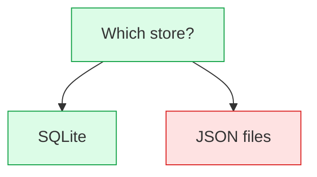

# CLI 参考

在项目任意子目录运行；命令会向上查找最近的 `adr/` 目录。

## 全局选项

| 选项 | 说明 |
| --- | --- |
| `-h, --help` | 打印帮助（`adrkit help` 等效） |
| `-V, --version` | 打印版本 |

## 命令

### `adrkit init [path] [--tools <list>]`

在 `path`（默认当前目录）创建 `adr/` 仓库，并把 agent 集成写入 `.agents/`
（`commands/` + `skills/`），即所有主流 Agent 都识别的供应商中立约定。
`--tools claude` 额外安装 `.claude/` 副本给 Claude Code（唯一不读
`.agents/` 的 Agent）；`--tools none` 不安装任何集成。

```text
adr/
├── config.yaml
├── README.md
├── .gitignore     # 让 adr/.drafts/ 不进 git
└── decisions/
```

提案是 `adr/.drafts/` 里的临时草稿；目录在第一次 `adrkit propose` 时创建。

### `adrkit decide <title> --raised-by <human|agent> --decided-by <human|agent>`

直接记录一条已做的决策到 `adr/decisions/N-slug.md`（默认路径）。标题不得
以数字开头。

两个声明都必填。`--raised-by` 记录谁把这条决策提上台面；`--decided-by`
记录谁的判断定下了它：方向由人决定时写 `human`（人说出的、人把 agent 的提案
改成最终落地方案的、或人此前定过而现在只是补记的），由 AI 自主判断得出时写
`agent`，包括人只是放行的情况。两个轴都可以是 `human` 或 `agent`。CLI 既不
推断也不校验，只记录声明。分不清时先问再记；谁提出、谁批准的细节写进正文。

### `adrkit propose <title>`

在 `adr/.drafts/YYYY-MM-DD-slug.md` 创建临时提案草稿。草稿是临时的：
`accept` 把它提升为编号决策，`reject` 直接丢弃、不留记录。标题不得以数字
开头。草稿既不带 `raised-by` 也不带 `decided-by`；写进去会被判为错误。

### `adrkit accept <name> --raised-by <human|agent> --decided-by <human|agent>`

校验草稿，分配下一个 `N` 编号，改写生命周期 section，写入
`adr/decisions/N-slug.md` 并删除草稿。草稿标题不得以数字开头。这里同样必须
提供 `--raised-by` 与 `--decided-by`，含义与 `decide` 一致：提升是声明进入
持久记录的时刻。

### `adrkit reject <name> [--reason <text>]`

从 `adr/.drafts/` 丢弃提案草稿。不产生任何记录：拒绝记录在胜出决策的
`Alternatives considered` 里。`--reason` 可选，仅回显。

### `adrkit list`

列出决策（accepted/superseded）与待决草稿。

### `adrkit show <name>`

打印记录。`name` 支持标题、文件名、决策编号或 slug。仓库中其他无法
解析的记录不会阻塞 `show`；`adrkit validate` 仍会报告它们。

### `adrkit status`

打印生命周期计数（accepted、superseded、待决草稿）与仓库校验状态。

### `adrkit instructions`

打印下一步工作流步骤（init、fix validation、decide 或 propose）。有待决
草稿时，每条草稿会标注为已验证（可直接接受）或需要修改，因此下一步是
可执行动作而非方向。

### `adrkit validate [name] [--all]`

校验单条记录；省略 `name` 或使用 `--all` 时校验整个仓库。单条记录校验
同样会检查 `superseded-by: N` 引用是否指向一个存在且未被 superseded 的
决策。

### `adrkit update [--tools <list>]`

重写 agent 集成：标准 `.agents/` 目标，加上 `--tools claude` 时的
`.claude/` 例外；不再选中的目标会被移除。未指定 `--tools` 时使用
`adr/config.yaml` 里记录的目标。

### `adrkit config`

打印当前配置。

### `adrkit graph [--mermaid|--dot|--text] [--formal-only] [--tag <tag>]`

输出决策关系图：实线边为 `superseded-by` 正式取代关系，虚线边为从正文
挖掘的 `ADR-N` 引用，按 `created` 创建日期分组，让决策脉冲可见而不伪造
连续时间线。`--mermaid`（默认）在 GitHub 上原生渲染，并按决策的第一个
`tag` 给活跃节点描边着色；`--dot` 输出 Graphviz；`--text` 输出终端友好的
树形视图。
`--tag <tag>` 只保留带该主题标签的决策；`--formal-only` 丢弃挖掘边。
注意 `date` 记录的是当前状态日期，`created` 才是创建日期。

### `adrkit tree <name> [--mermaid|--text|--html]`

渲染记录的可选 `## Deliberation` 附录：决策背后的设计树，以嵌套 Markdown
列表保存在记录里，节点可标注 `[settled]`、`[rejected]` 或 `[open]`，问题还可
用 `(round N)` 记录 frontier 轮次。
`name` 的解析方式与其他命令一致（标题、文件名或决策编号）。默认 `--text`
输出嵌套大纲：

```text
- Which store? [settled]
  - SQLite [settled]
  - JSON files [rejected]
    - Need a migration story? [open]
```

`--mermaid` 输出 Mermaid 图：`graph TD` 头、每个条目一个节点、父子边、每个
状态一行 `classDef`，以及树实际用到的每个状态一行 `class`。问题带 `(round N)`
时，每一轮的节点会归入一个带标签的 subgraph。`--html` 把同一份 Mermaid 源码
包进一个自包含的 HTML 文档。



记录中没有 `## Deliberation` 列表时，命令会报出记录名并失败。该附录只是那
一条决策的参考资料，不是每个任务都要读的内容。

### `adrkit completion <bash|zsh|fish>`

打印 shell 补全脚本。

### `adrkit version`

打印版本。
